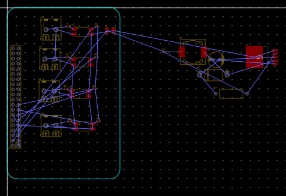
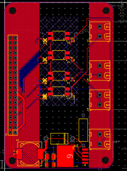
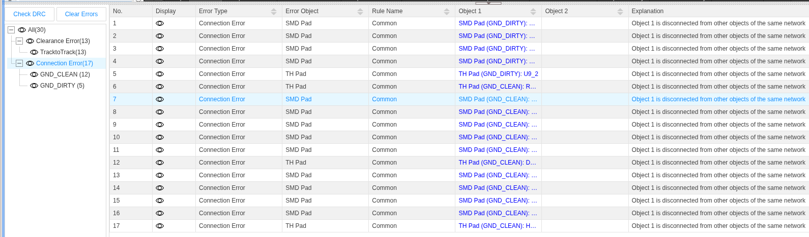
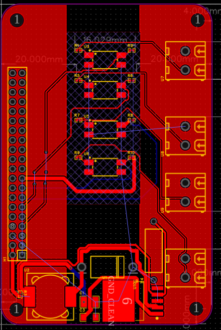
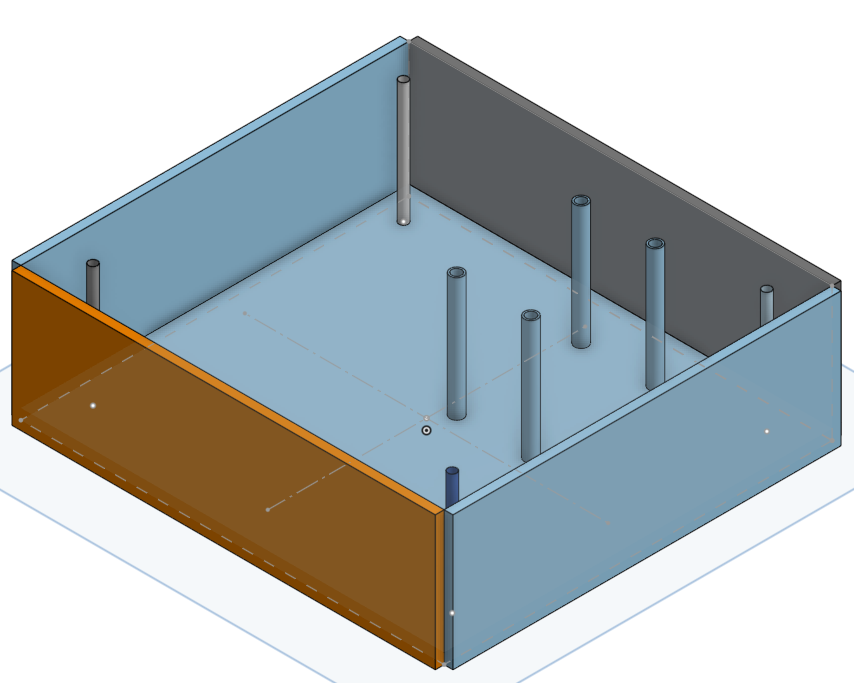
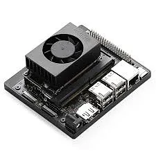
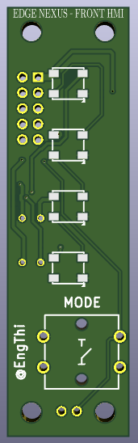
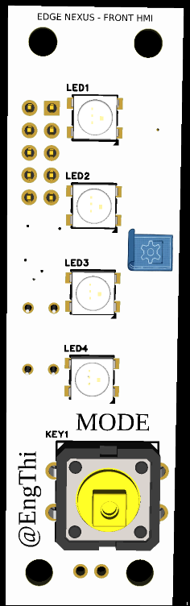
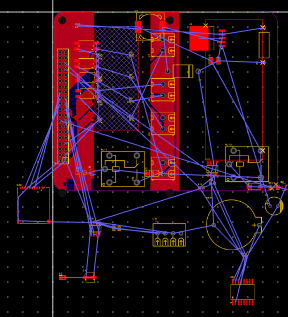

# Edge Nexus Build Logs

_Industrial isolation and standalone control._

Approximate time: **~85h**

Edge Nexus started because I wanted something closer to real industrial hardware, not only another dev board plugged into jumper wires. The main idea was isolation first: if this is going near noisy sensors, relays, long wires, or anything factory-like, the `ESP32` side cannot be directly exposed to everything.

I did not want this to feel like "I connected a module and called it a controller". I wanted the board to have some real protection and a reason to exist :D

---

### Feb 27

_Time spent: ~5h_

I started with the schematic and the first PCB layout in `EasyEDA`.

The first real block was the input side. I designed a 4-channel isolation front-end using `PC817` optocouplers and screw terminals. Each channel got a `470 ohm` resistor on the sensor/input side for 5V signals and `10k` pull-ups on the 3.3V side.

This was the part where the board stopped being "just ESP32 stuff" and started looking like something that could survive a rougher environment. At least in theory. Hardware always has that little fear of "ok but will this actually work when powered?" :|

I also added the 40-pin header strategy here. It is not the whole point of V2 anymore, but it stayed useful as an expansion/service connector and for keeping the board flexible.

---

### Feb 28 - Mar 2

_Time spent: ~13h_

Routing was annoying from the start :/

The `EasyEDA` auto-router completely ignored the point of galvanic isolation. It tried to route traces through the isolation barrier, which basically destroys the reason for using optocouplers. So I deleted that and routed manually.

The `LM2596` buck area also needed attention because I wanted it to handle real current. I used wider traces around the power section and kept checking the copper pours because they kept refusing to connect in the way I expected.

At one point I had more than 70 `DRC` errors. Some were real problems, some were clearance settings fighting me. I reset the clearance rules to `0.254mm`, routed ground more carefully, and got it down to 0 errors. That felt very good, because before that it looked like the board was just screaming at me.

This was not glamorous. It was mostly moving traces, checking, getting annoyed, and moving them again :/

---

### Mar 3 - Mar 6

_Time spent: ~8h_

I imported the PCB `.STEP` into `OnShape` and started designing the chassis.

I wanted it to feel more like an industrial controller than a random exposed PCB. That meant thinking about where the board sits, where screws go, how the case closes, and whether the mounting holes actually line up. They did not line up perfectly at first, so I had to go back to `EasyEDA`, fix holes, export again, and check the CAD again.

This back-and-forth is boring but it is also the kind of thing that makes the final project not look improvised.

Small mechanical mistakes are very easy to ignore in 2D and very obvious in 3D. Painful but useful :/

---

### Mar 7 - Mar 9

_Time spent: ~11h_

I worked on the front HMI board. It is a small `70x20mm` board for the front panel with `WS2812B` LEDs and a simple interface idea.

The traces were not complicated like the main board, but I still had to be careful with power. The `5V` and `GND` lines for LEDs need to be more serious than tiny signal traces.

At this stage the project was still connected to the idea of using a Jetson/Orange Pi style SBC. I thought the shield plus HMI plus enclosure would be enough.

Looking back, this was the "almost cool but not really the right project yet" phase.

---

### Mar 10 - Mar 17

_Time spent: ~20h_

I integrated the first version into the enclosure. The isolation board sat above the SBC area, and the HMI board mounted behind the front panel with `M3` bolts.

I changed the front from one big display/window cutout to individual LED/button cutouts. It looked cleaner and more like a piece of equipment instead of a box with a random hole.

I also wrote a small `Jetson.GPIO` LED test script and cleaned up the repo. At this point I thought V1 was basically done.

_It was not done._

---

### Mar 18 - Mar 27

_Time spent: ~15h_

The review changed the project a lot.

The feedback was basically that Hack Club funds custom hardware, not a $150 NVIDIA computer with my shield sitting on top. That hurt a bit, but it was fair. V1 still depended too much on a prebuilt SBC.

I had that moment of "bruh... yeah, they are right" :(

So I pivoted Edge Nexus into a standalone controller around an `ESP32-S3 WeAct Studio` module. The 40-pin header stayed in the design as an expansion/service connector, but the board no longer depends on a Jetson/Orange Pi to be the brain.

What changed:

- Added `SP3485` for `RS-485`.
- Added 2 relays for switching loads.
- Added `INA219` power monitoring.
- Added `SHT41` temperature/humidity sensing.
- Added `DS3231` RTC for offline timekeeping.
- Added MicroSD logging.
- Kept the `PC817` isolation stage.

The component count got much bigger, but I still wanted the board around `100x80mm`. This was the most "ok, now this is actually hardware engineering" part.

---

### Mar 28 - Mar 31

_Time spent: ~10h_

Fitting everything was a puzzle.

One rookie mistake: I had screw terminals too far inside the board at one point. That looks fine in PCB view until you imagine using a screwdriver and the `ESP32` module is in the way. So I moved connectors toward the edges. Very obvious after noticing it, very annoying before noticing it.

I also used the vertical space more aggressively. The `CR2032` holder sits under the raised ESP32 module area, which saves board space without making the board larger.

For isolation, I kept a `1.5mm` air gap between the noisy/input side and the logic side. I also split the ground thinking into cleaner and dirtier areas so the isolation section still makes sense physically.

_Small board, too many parts, lots of moving things around._ :|

---

### Apr 1

_Time spent: ~2h_

Final cleanup day. Or at least "please be final" day.

I fixed a collision between the MicroSD slot and the ESP32 in the 3D view, updated silkscreen labels, generated the Gerbers/BOM, and adjusted the enclosure for the new V2 board.

At that point, the hardware cost was:

- AliExpress ESP32-S3: $6.66
- LCSC components cart: $43.43
- JLCPCB bare PCB: $6.10
- **Total: $56.19**

I am not using PCBA, so this means hand soldering the board. Not relaxing, but it keeps the project under the budget and makes the build more real. Also a little scary, because small parts do not care that this is my project :/

Timelapses:

- [New parts and searching](https://lapse.hackclub.com/timelapse/lmfT6dZKEx6h)
- [Working to submit](https://lapse.hackclub.com/timelapse/3QgjKu2FWrUs)
- [Making the pivot](https://lapse.hackclub.com/timelapse/ZSAejujQKgtY)

Edge Nexus V2 is ready enough to submit. I hope this one makes the point better :)

###### May 8 — Final Cart Fix, Because I Did Forget Something
*Time spent: ~1h*
Updated the final carts before submission and then had the annoying reviewer moment: "maybe something is missing". It was. I had the Main Shield cart clean, but the Front HMI had its own little BOM with the LEDs, button, MOSFET, header and caps, and I had not reflected that properly in the root `BOM.csv`.

So now the budget is honest: ESP32 from AliExpress is $6.87, Main Shield LCSC cart is $26.52, Front HMI LCSC cart is $5.53, and the selected JLCPCB boards are $11.10 because I picked the HMI with logo/sign plus the shield. Final merchandise total is **$50.02** before shipping/taxes. Still under $60, but yeah, not the fake-clean $42.49 anymore :/
