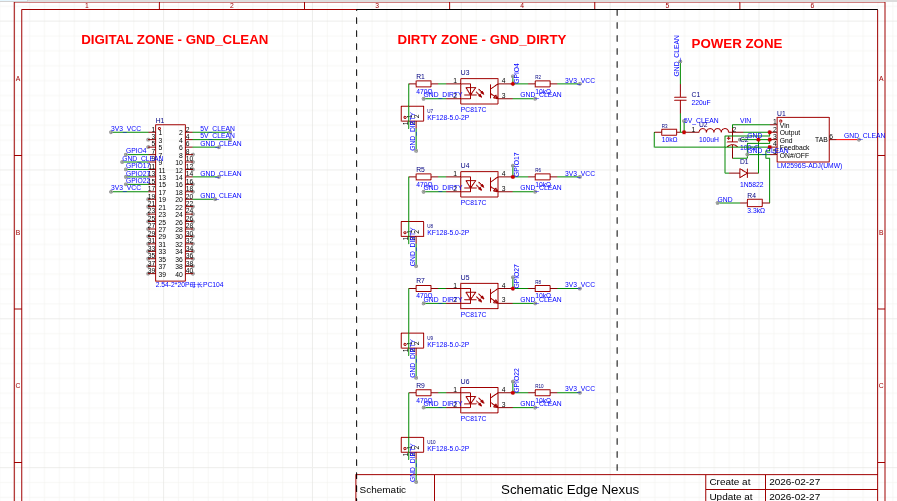

## 2026-02-27 Day 1

**Focus:** Schematic design and initial PCB laypout in EasyEDA

## What I worked on

**Opto-isolation input stage**
Designed a 4-channel galvanic isolationfront-end using PC817 optocouplers and screw terminals. Each channels uses calculated input resistors `(470 Ω for 5V sensors)`and 10KΩ pull-ups on the 3.3 V side to protect the SoC GPIOs from dirty, salvaged sensors.

**Connector strategys:**
Chose a 40-pin header footprint compatible with common ARM SoMs (Orange PI/Raspberry Pi style). This keeps the design flexible: the same shield can leter be used with other boards or systems without changing the isolation circuitry.

### Time spent **Approx:** 5 hours (schematic, part selection, calculations, and first placement pass)

### Notes
- Today's work establishes the eletrical safety layer for future experiments with ARM-based edge AI (initially targeting an RK3588 SoC/ some SoM in this type). 
