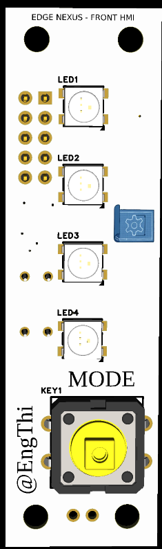
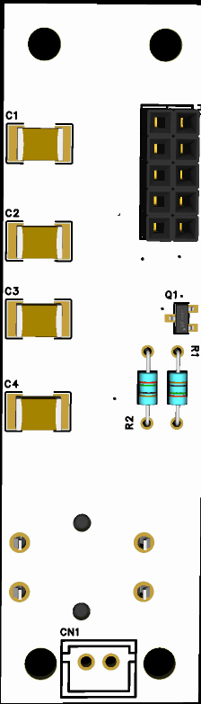
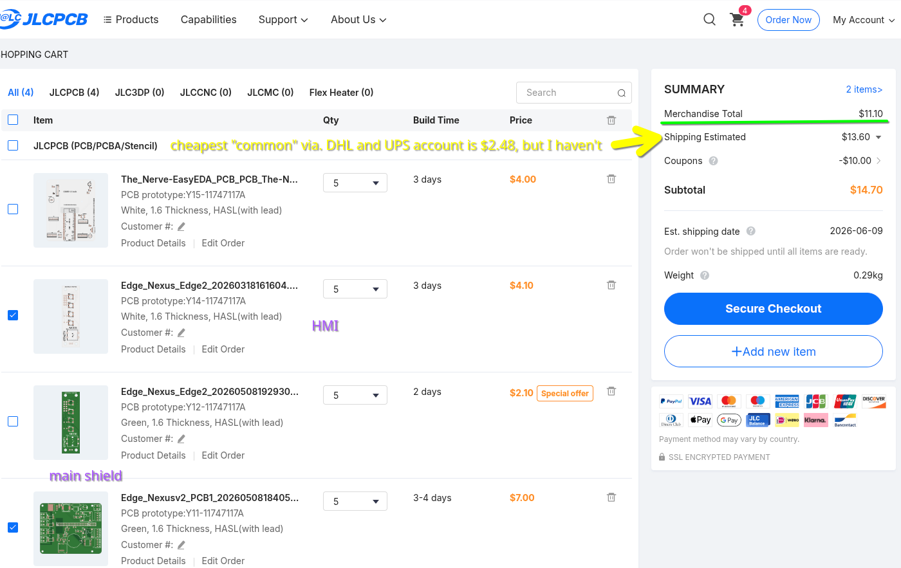
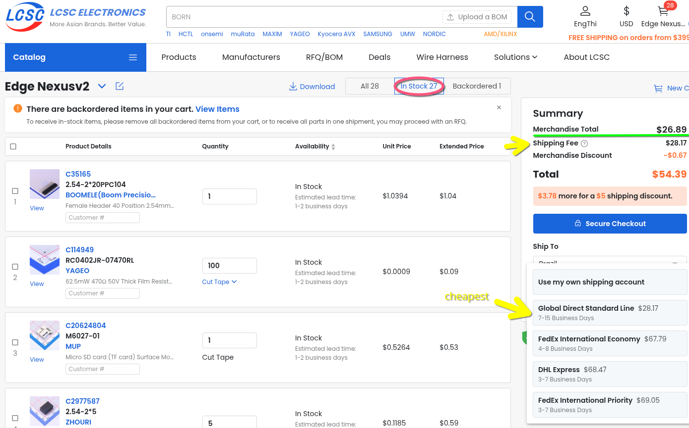
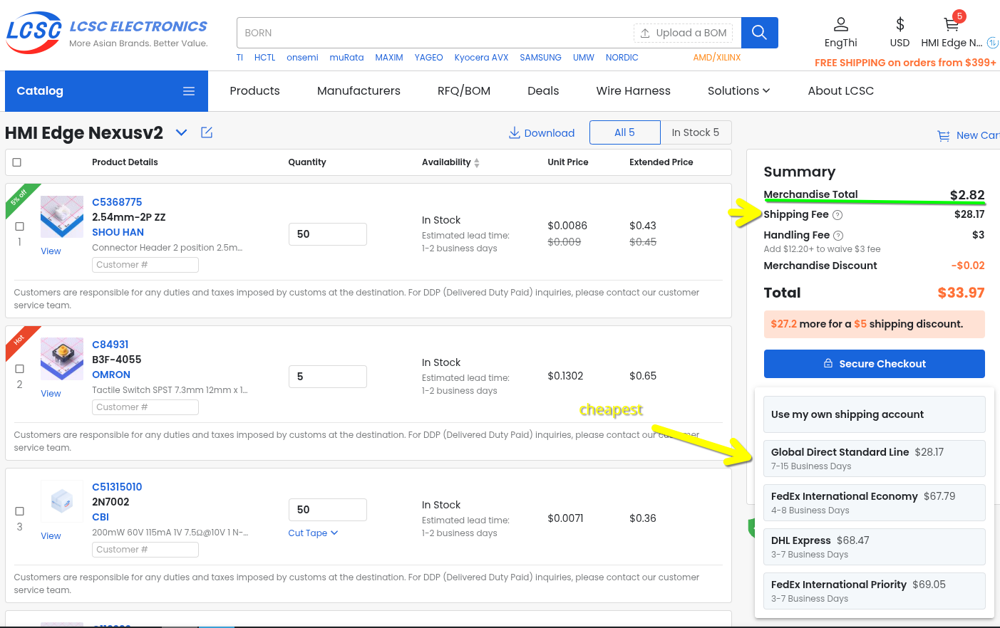
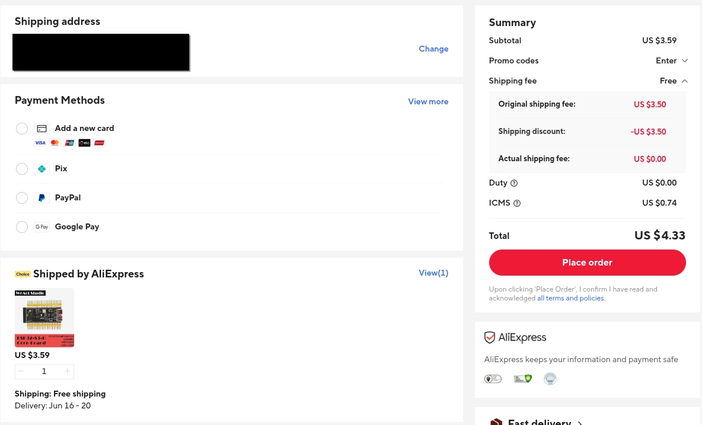

# Edge Nexus: Standalone Industrial Edge Controller

This is a custom industrial carrier board I built for high-noise environments. It uses PC817 optocouplers for isolation and has RS-485/Modbus comms through an SP3485 chip. I wrote all the docs myself, including the 80+ hours of logs in JOURNAL.md. I managed to get the hardware under $50 by sourcing directly from LCSC and AliExpress.

> [!IMPORTANT]
> A reviewer warned me that something might be missing, and yeah, they were right :/
> I had the Main Shield BOM/carts updated, but I forgot that the Front HMI has its own BOM parts and that the JLCPCB cart had changed after I picked the logo/sign HMI board. Fixed now: `BOM.csv` includes the Main Shield + Front HMI parts, and the cart proofs below show the current totals.


## Why I built this

Edge Nexus is an industrial controller meant to bridge the gap between standard IoT boards and noisy factory floors. It started as a shield for bigger SBCs, but I decided to make it standalone. It focuses on actual hardware engineering rather than just plugging things into a Linux computer.

I'm a Computer Engineering student and I wanted a solid, protected brain for automation and logging that doesn't cost a fortune like those industrial PLCs you see out there.

## On the board

- ESP32-S3 (WeAct Studio module). It handles the logic, WiFi, and Bluetooth.
- 4-channel input protection using PC817 optocouplers. This stops high-voltage spikes from killing the ESP32.
- SP3485 transceiver for RS-485 / Modbus. This is the standard for industrial PLCs.
- Built-in LM2596 buck converter. You can power the whole thing from a 12-19V laptop brick.
- Two 5V relays to switch actual loads.
- INA219 for power monitoring, SHT41 for temp/humidity, and a DS3231 RTC for keeping time offline.
- MicroSD slot to save logs without needing a cloud connection.
- 40-pin expansion/service header kept for debugging, future wiring, and compatibility experiments.
- Front HMI board with WS2812B status LEDs and a tactile button.

## Design and Making it

### PCB Layout

*V2 Standalone Controller and the routing details.*





### Mechanicals
I designed the enclosure in OnShape with mounting bosses and enough space for the relays and the ESP32.
- [OnShape Public Link](https://cad.onshape.com/documents/763a97ddcd49a121183cadac/w/b6354cba14e3b3f32c74d1b6/e/a910c6222f3a54e8127254ee?renderMode=0&uiState=6a24c03cbd7ed56dfac8336c)

## How I'm assembling it

The PCB is coming bare from JLCPCB. I'm hand-soldering everything myself—optoacopladores, the transceiver, buck converter, and all the headers. I want to verify the isolation gap and continuity manually before I ever turn it on.

## Cost to replicate

This is the price for the parts, not including shipping or taxes.


*Selected JLCPCB PCBs: shield + HMI with logo/sign. The older HMI item is still visible in the cart but is not selected.*


*Main Shield parts from LCSC.*


*Front HMI parts from LCSC. One item is backordered in the screenshot, so this can still move a little.*


*ESP32-S3 from AliExpress.*

| Item | Qty | From | Price |
| :--- | :--- | :--- | :--- |
| ESP32-S3 WeAct Studio | 1 | AliExpress | $4.33 |
| Main Shield components cart | 1 set | LCSC | $28.43 |
| Front HMI components cart | 1 set | LCSC | $2.80 |
| PCB Manufacturing (Shield + HMI) | 1 set | JLCPCB | $11.10 |
| **Subtotal (Hardware Only)** | | | **$46.66** |

*(Full details with shipping and taxes in [BLUEPRINT_BUDGET.md](BLUEPRINT_BUDGET.md))*

That total is the real merchandise/cart number before shipping and taxes. It is not a perfect "one resistor costs this much" calculation, because LCSC has MOQ and stock weirdness. Still, it is the number I would rather show because it is what I actually see in the carts.

Note for people in Brazil (São Paulo): If you are around Santa Ifigênia, you can get most of the passives and connectors there for cheap. The ESP32 and LCSC orders usually stay under the tax limit if you're careful.

Check BOM.csv for the full list of Main Shield and Front HMI parts.

### Shipping info
I used Global Standard Direct Line for the PCBs, which is the cheapest tracked option to Brazil.


## Folder Structure

```
├── BOM.csv                         # Full parts list
├── JOURNAL.md                      # Engineering logs
├── Hardware/
│   ├── Main_Shield/
│   │   ├── Fabrication/            # Gerbers and BOM
│   │   ├── PCB/                    # EasyEDA files
│   │   └── Schematics/             # PDF Schematic
│   ├── Front_HMI/                  # HMI board files
│   └── 3D_Models/                  # STEP files
├── Docs/                           # Images and renders
└── software/
    └── main.py                     # Firmware
```

---

Developed for Hack Club Blueprint 2026. Designed by @EngThi
