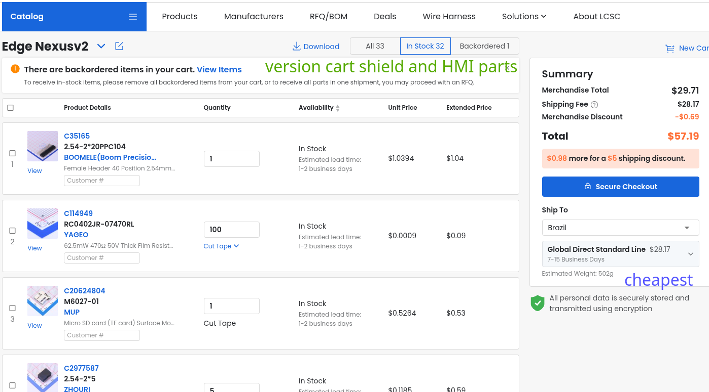

# Edge Nexus: Standalone Industrial Edge Controller

This is a custom industrial carrier board I built for high-noise environments. It uses PC817 optocouplers for isolation and has RS-485/Modbus comms through an SP3485 chip. I managed to get the hardware under $50 by sourcing directly from LCSC and AliExpress.


## Why I built this

Edge Nexus is an industrial controller meant to bridge the gap between standard IoT boards and noisy factory floors. It started as a shield for bigger SBCs, but I decided to make it standalone. It focuses on actual hardware engineering rather than just plugging things into a Linux computer.

I'm a Computer Engineering student and I wanted a solid, protected brain for automation and logging that doesn't cost a fortune like those industrial PLCs you see out there.

## On the board

- ESP32-S3 (WeAct Studio module). It handles the logic, WiFi, and Bluetooth.
- 4-channel input protection using PC817 optocouplers. This stops high-voltage spikes from killing the ESP32.
- SP3485 transceiver for RS-485 / Modbus. This is the standard for industrial PLCs.
- Built-in LM2596 buck converter. You can power the whole thing from a 12-19V laptop brick.
- Two 5V relays to switch actual loads.
- INA219 for power monitoring, SHT41 for temp/humidity, and a DS3231 RTC for keeping time offline.
- MicroSD slot to save logs without needing a cloud connection.
- 40-pin expansion/service header kept for debugging, future wiring, and compatibility experiments.
- Front HMI board with WS2812B status LEDs and a tactile button.

## Design and Making it

### PCB Layout

*V2 Standalone Controller and the routing details.*


### Mechanicals
I designed the enclosure in OnShape with mounting bosses and enough space for the relays and the ESP32.
- [OnShape Public Link](https://cad.onshape.com/documents/763a97ddcd49a121183cadac/w/b6354cba14e3b3f32c74d1b6/e/a910c6222f3a54e8127254ee?renderMode=0&uiState=6a24c03cbd7ed56dfac8336c)

## How to use it

### Power

The board runs on 12 to 19V DC via a barrel jack. Those small power bricks
that come with set-top boxes and older electronics (the kind everyone has
lying around here in Brazil, usually 12V P4) work fine. Laptop chargers
cover the 19V end. If it outputs somewhere in that range and the connector
fits, it probably works :)

One thing worth knowing: I originally designed this thinking about a
Jetson Nano doing the heavy lifting, model finetuning, industrial
simulations, the kind of workload that needs real compute. After the pivot
to ESP32-S3 that changed. The ESP handles control logic, comms, and
logging really well but it is not going to run ML workloads :/. The 40-pin
header stayed in as an expansion connector if you ever want to attach
something more powerful later.

### DIRTY side vs CLEAN side

The left side of the board is the DIRTY side, that is where your sensors,
actuators, and anything with messy real-world signals connect via screw
terminals. Those signals never touch the ESP directly. The PC817
optocouplers convert them to light pulses and pass only the logic signal
across the isolation barrier to the CLEAN side where the ESP lives. So if
something on the DIRTY side has a spike or does something weird, the ESP
does not care :p

### Flashing the ESP32-S3

I went with MicroPython because iteration is faster, write a `.py`,
upload, test, repeat. But the ESP32-S3 works with C/C++ and even Rust if
you prefer.

**MicroPython:**
Grab the binary for the S3 from the
[official MicroPython page](https://micropython.org/download/ESP32_GENERIC_S3/).
Best IDE for this is Thonny, pick the version, connect the board, select
the COM port and flash the `.bin`. To enter flash mode hold BOOT, tap
EN/RST then release BOOT. Wait for it to finish and you are good :). After
that you write and test `.py` files straight from Thonny's console.

**C/C++ via Arduino IDE, PlatformIO, or ESP-IDF:**
Pick your board (ESP32-S3), pick the COM port, compile and flash. Most of
the time you do not even need to hold BOOT, the toolchain handles it. If
the flash fails or the bar just hangs, hold BOOT when it starts uploading
and release once it moves. That usually fixes it :/

### RS-485 and Modbus

The SP3485 transceiver gives you RS-485, same physical layer most
industrial PLCs use. Modbus RTU runs on top of that so you can talk to
PLCs, VFDs, sensors, basically anything on a factory floor that has a
Modbus register map. Two wires (A and B), twisted pair, multiple devices
on the same bus. The firmware handles DE/RE pin direction switching
automatically so you do not have to manage that manually.

### SD card logging

There is a MicroSD slot that saves telemetry to a simple `.csv`, temperature,
humidity, relay state, timestamps, whatever the firmware is collecting. Right
now it just keeps appending rows to one file :/

Still on the list: better file rotation, separate files per task, checking
card health on boot instead of just assuming it is there. Also been thinking
about pushing data to a cloud dashboard via webhooks, something like
[Blynk](https://www.blynk.io/) which I used in my TCC (that is kind of like
a Capstone Project or Undergraduate Thesis, from my Industrial Automation
technician course here in Brazil). WiFi is already there on the ESP, just
have not wired that part up yet :)

## How I'm assembling it

The PCB is coming bare from JLCPCB. I'm hand-soldering everything myself—optoacopladores, the transceiver, buck converter, and all the headers. I want to verify the isolation gap and continuity manually before I ever turn it on.

## Cost to replicate

This is the price for the parts, not including shipping or taxes.


*Selected JLCPCB PCBs: shield + HMI with logo/sign.*


*Main Shield parts from LCSC. This is the cart I submitted with the project.*


*Front HMI parts from LCSC.*


*ESP32-S3 from AliExpress.*

| Item | Qty | From | Price |
| :--- | :--- | :--- | :--- |
| ESP32-S3 WeAct Studio | 1 | AliExpress | $4.33 |
| Main Shield components cart | 1 set | LCSC | $26.89 |
| Front HMI components cart | 1 set | LCSC | $2.82 |
| PCB Manufacturing (Shield + HMI) | 1 set | JLCPCB | $11.10 |
| **Subtotal (Hardware Only)** | | | **$45.14** |

> **Note on cost optimization:** After submitting the form, I noticed that
> combining both LCSC carts into one order drops the total merchandise to
> $29.71 and cuts shipping to a single $28.17 charge instead of two.
> Here's what that looks like:
>
> 
> *Shield + HMI parts in one cart — $29.71 merchandise, one shipping charge.*

*(Full details with shipping and taxes in [BLUEPRINT_BUDGET.md](BLUEPRINT_BUDGET.md))*

That total is the real merchandise/cart number before shipping and taxes. It is not a perfect "one resistor costs this much" calculation, because LCSC has MOQ and stock weirdness. Still, it is the number I would rather show because it is what I actually see in the carts.

Note for people in Brazil (São Paulo): If you are around Santa Ifigênia, you can get most of the passives and connectors there for cheap. The ESP32 and LCSC orders usually stay under the tax limit if you're careful.

Check BOM.csv

### Shipping info
I used Global Standard Direct Line for the PCBs, which is the cheapest tracked option to Brazil.

## Folder Structure

```
├── BOM.csv                         # Full parts list
├── JOURNAL.md                      # Engineering logs
├── Hardware/
│   ├── Main_Shield/
│   │   ├── Fabrication/            # Gerbers and BOM
│   │   ├── PCB/                    # EasyEDA files
│   │   └── Schematics/             # PDF Schematic
│   ├── Front_HMI/                  # HMI board files
│   └── 3D_Models/                  # STEP files
├── Docs/                           # Images and renders
└── software/
    └── main.py                     # Firmware
```

---

Developed for Hack Club Blueprint 2026. Designed by @EngThi
