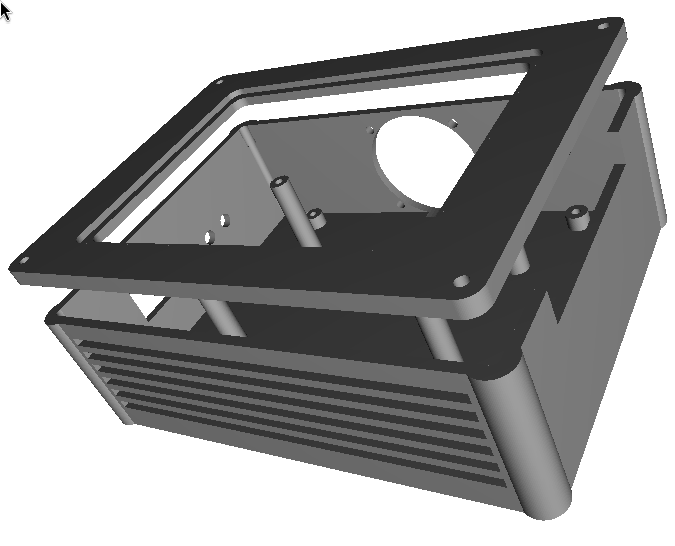

# 🛰️ Edge Nexus: Industrial Isolation for Jetson AI

**A custom carrier-shield and rugged enclosure for the NVIDIA Jetson Orin Nano Super.**

## 🚀 The Vision

Edge Nexus bridges the gap between high-performance AI SoCs and the "dirty" world of salvaged industrial hardware. It provides a reliable brain for local AI pipelines, automation, and computer vision without risking expensive processors when connecting unshielded sensors or recycled motors.

Originally designed for generic ARM SoCs (RK3588), the project **pivoted to the NVIDIA Jetson Orin Nano Super** to leverage professional-grade CUDA/TensorRT acceleration, while adding a custom industrial safety layer and a rugged, EMI-aware housing.

## 🔌 Core Hardware Features

- **Galvanic Isolation:** 4-channel input protection using PC817 optocouplers. This physically decouples high-voltage spikes from "dirty" field sensors from the sensitive Jetson GPIOs.
- **Power Management:** Integrated LM2596 buck converter stage. It steps down 12-19V (from laptop bricks) to a stable 5V rail to power both the SoC and the HMI layer.
- **Split-Plane Design:** A dedicated physical "no-man's-land" gap between `GND_CLEAN` and `GND_DIRTY` on the PCB to prevent EMI/RFI noise coupling.
- **Front HMI Module:** A dedicated 70x20mm PCB with 4x WS2812B LEDs and a Mode/Emergency button for real-time status feedback.

## 🛠️ Design & Fabrication

### PCB Design (EasyEDA / KiCad)

*Left: Isolation Shield Layout | Right: Front HMI Routing.*

### Mechanical Engineering (OnShape)
The enclosure features integrated mounting bosses, internal standoffs at Z=35mm, and optimized airflow paths to prevent thermal throttling under high AI workloads.
- **[OnShape Public Document Link](https://cad.onshape.com/documents/94f51a65c203ef61216a8e76/w/3996b9a7978ffab042ea39f4/e/1a9b65c9926a8d71aaf1da83?renderMode=0&uiState=69c037fa21771c3657426373)**

*Complete Enclosure Render.*

## 🛒 Replication Cost & BOM

This Bill of Materials (BOM) focuses on the **replication cost** for a single unit, excluding shipping, taxes, and import fees.

| Component | Quantity | Supplier | Unit Price (Real) | Link |
| :--- | :--- | :--- | :--- | :--- |
| **NVIDIA Jetson Orin Nano Super** | 1 | Arrow | $249.00 | [Link](https://www.arrow.com/en/products/945-13766-0000-000/nvidia.html) |
| **PC817, LM2596, WS2812B & Passives** | 1 set | LCSC | $14.92 | [LCSC Cart Total] |
| **PCB Manufacturing (Shield + HMI)** | 1 set | JLCPCB | $6.10 | [JLCPCB Cart Total] |
| **Total Project Cost** | **-** | **-** | **$270.02** | **(No tax/shipping)** |

> **🇧🇷 Note for Brazilian Devs (São Paulo/Hack Clubbers):** Due to local import taxes and shipping, the total cost might be closer to this USD value but paid in BRL with significant overhead. However, most passive components (resistors, caps, headers) can be sourced cheaply at Santa Ifigênia.

For the complete list of parts with Manufacturer Part Numbers (MPN) and MOQ, check the main `BOM.csv` file.

## 📦 Components Ready for Assembly

*Hardware components in hand and ready for assembly.*

## 📂 Project Structure

*   `BOM.csv`: Complete project Bill of Materials (Main).
*   `/Hardware`:
    *   `/Hardware/3D_Models`: `.STEP` and `.STL` files for enclosure and PCBs.
    *   `/Hardware/Main_Shield`: Manufacturing and PCB files for the Isolation Shield.
    *   `/Hardware/Front_HMI`: Manufacturing and PCB files for the HMI board.
*   `/Docs`:
    *   `/Docs/assets`: Documentation images, renders, and screenshots.
*   `JOURNAL.md`: The complete technical development log.

## 📝 How to Use
1.  **Fabricate:** Send the Gerber files in `/Hardware/*/Fabrication` to a PCB house like JLCPCB.
2.  **Assemble:** Use the `BOM.csv` to source parts. Solder components onto the Isolation Shield and HMI board.
3.  **3D Print:** Print the enclosure files from `/Hardware/3D_Models`.
4.  **Connect:** Stack the Edge Nexus Shield onto the NVIDIA Jetson 40-pin header.

***

_Developed for the Hack Club Blueprint 2026._
_Designed by @EngThi_
