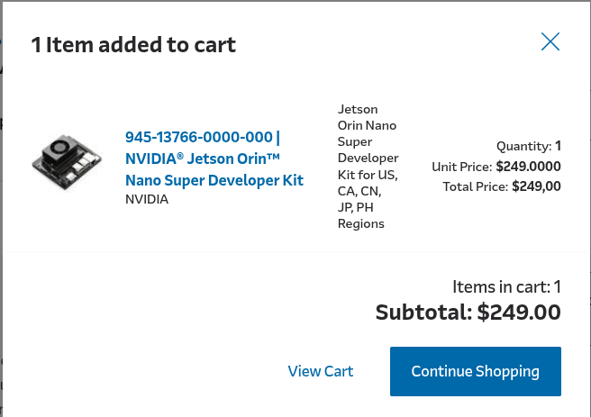
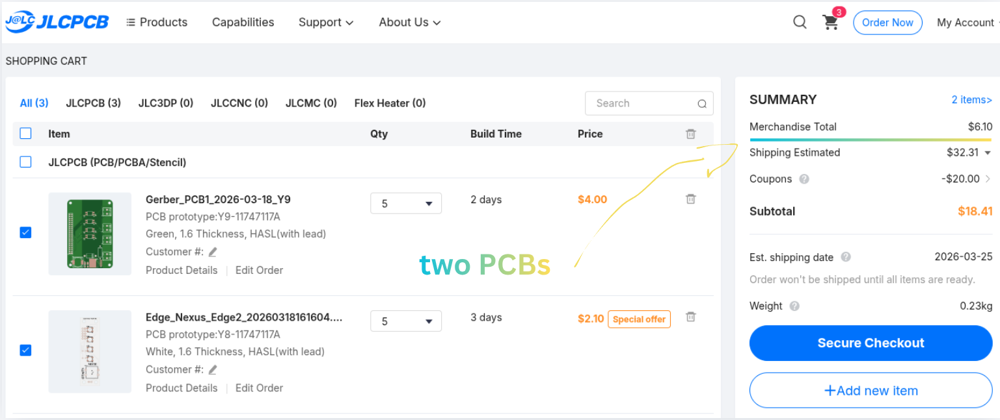
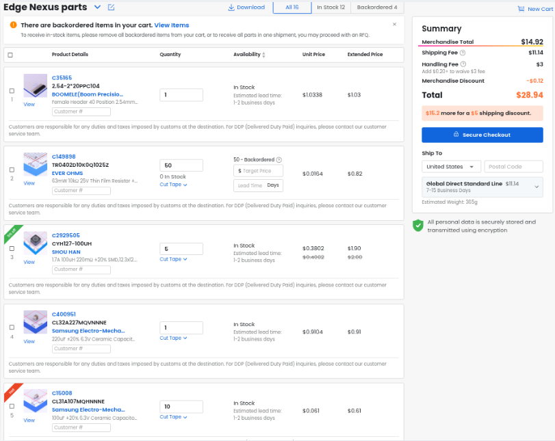
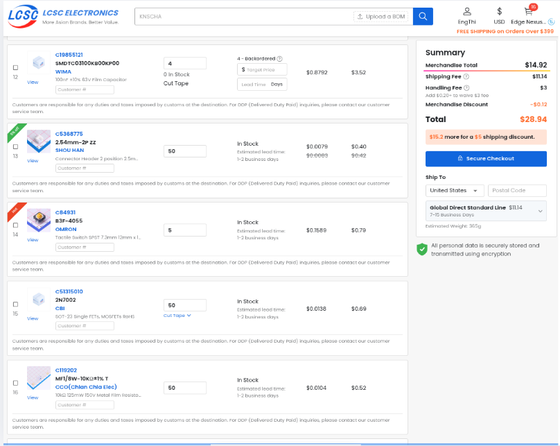

# 🛰️ Edge Nexus: Industrial Isolation for Jetson AI

**A custom carrier-shield and rugged enclosure for the NVIDIA Jetson Orin Nano Super.**

## 🚀 The Vision

Edge Nexus bridges the gap between high-performance AI SoCs and the "dirty" world of salvaged industrial hardware. It provides a reliable brain for local AI pipelines, automation, and computer vision without risking expensive processors when connecting unshielded sensors or recycled motors.

Originally designed for generic ARM SoCs (RK3588), the project **pivoted to the NVIDIA Jetson Orin Nano Super** to leverage professional-grade CUDA/TensorRT acceleration, while adding a custom industrial safety layer and a rugged, EMI-aware housing.

## 🔌 Core Hardware Features

- **Galvanic Isolation:** 4-channel input protection using PC817 optocouplers. This physically decouples high-voltage spikes from "dirty" field sensors from the sensitive Jetson GPIOs.
- **Power Management:** Integrated LM2596 buck converter stage. It steps down 12-19V (from laptop bricks) to a stable 5V rail to power both the SoC and the HMI layer.
- **Split-Plane Design:** A dedicated physical "no-man's-land" gap between `GND_CLEAN` and `GND_DIRTY` on the PCB to prevent EMI/RFI noise coupling.
- **Front HMI Module:** A dedicated 70x20mm PCB with 4x WS2812B LEDs and a Mode/Emergency button for real-time status feedback.

## 🛠️ Design & Fabrication

### PCB Design (EasyEDA / KiCad)

*Left: Isolation Shield Layout | Right: Front HMI Routing.*

### Mechanical Engineering (OnShape)
The enclosure features integrated mounting bosses, internal standoffs at Z=35mm, and optimized airflow paths to prevent thermal throttling under high AI workloads.
- **[OnShape Public Document Link (PENDING - PLEASE UPDATE)]**

## 🛒 Budget & Bill of Materials

*NVIDIA Jetson Orin Nano Super Developer Kit (Arrow.com).*

*Ordering both PCBs (Shield & HMI) from JLCPCB.*

### Key Components List (BOM)
| Component | Quantity | Supplier | Link |
| :--- | :--- | :--- | :--- |
| **NVIDIA Jetson Orin Nano Super** | 1 | Arrow | [Link](https://www.arrow.com/en/products/945-13766-0000-000/nvidia.html) |
| **PC817C Optocoupler** | 4 | LCSC | [Link](https://www.lcsc.com/product-detail/Optoisolators-Transistor-Photovoltaic-Output_GOODWORK-PC817C_C3025164.html) |
| **LM2596S-ADJ Buck Converter** | 1 | LCSC | [Link](https://www.lcsc.com/product-detail/DC-DC-Converters_UMW-友台半导体-LM2596S-ADJ-UMW_C347423.html) |
| **WS2812B-V5 RGB LED** | 4 | LCSC | [Link](https://www.lcsc.com/product-detail/RGB-LEDs-Built-in-IC_worldsemi-WS2812B-V5_C2846931.html) |

## 📦 Components Ready for Assembly

*Hardware components in hand and ready for assembly.*

## 📂 Project Structure

*   `BOM.csv`: Complete project Bill of Materials (Main).
*   `/Hardware`:
    *   `/Hardware/3D_Models`: `.STEP` and `.STL` files for enclosure and PCBs.
    *   `/Hardware/Main_Shield`: Manufacturing and PCB files for the Isolation Shield.
    *   `/Hardware/Front_HMI`: Manufacturing and PCB files for the HMI board.
*   `/Docs`:
    *   `/Docs/assets`: Documentation images, renders, and screenshots.
*   `JOURNAL.md`: The complete technical development log.

## 📝 How to Use
1.  **Fabricate:** Send the Gerber files in `/Hardware/*/Fabrication` to a PCB house like JLCPCB.
2.  **Assemble:** Use the `BOM.csv` to source parts. Solder components onto the Isolation Shield and HMI board.
3.  **3D Print:** Print the enclosure files from `/Hardware/3D_Models`.
4.  **Connect:** Stack the Edge Nexus Shield onto the NVIDIA Jetson 40-pin header.

***

_Developed for the Hack Club Blueprint 2026._
_Designed by @EngThi_
