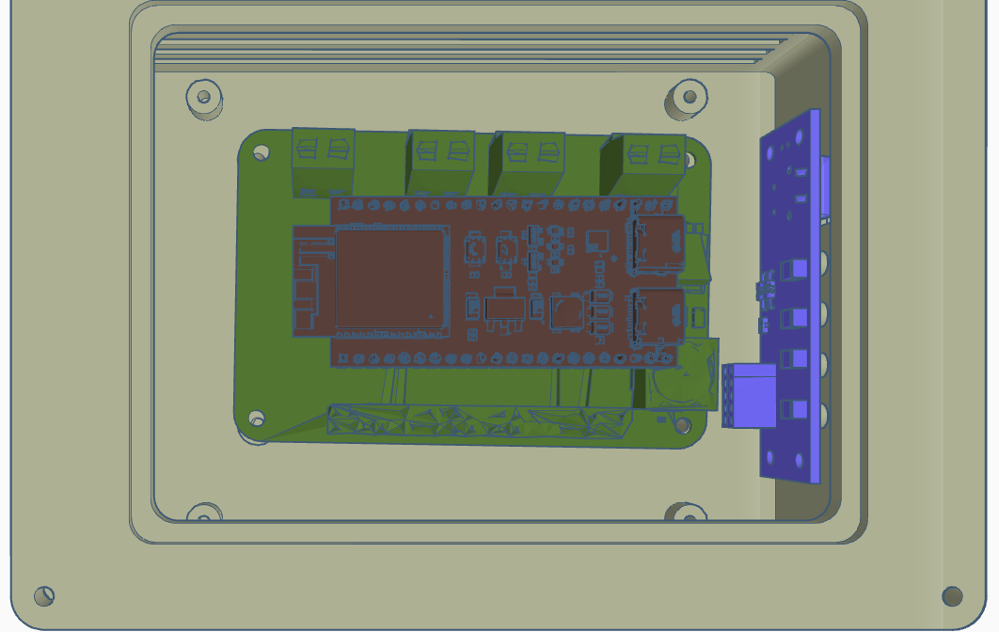
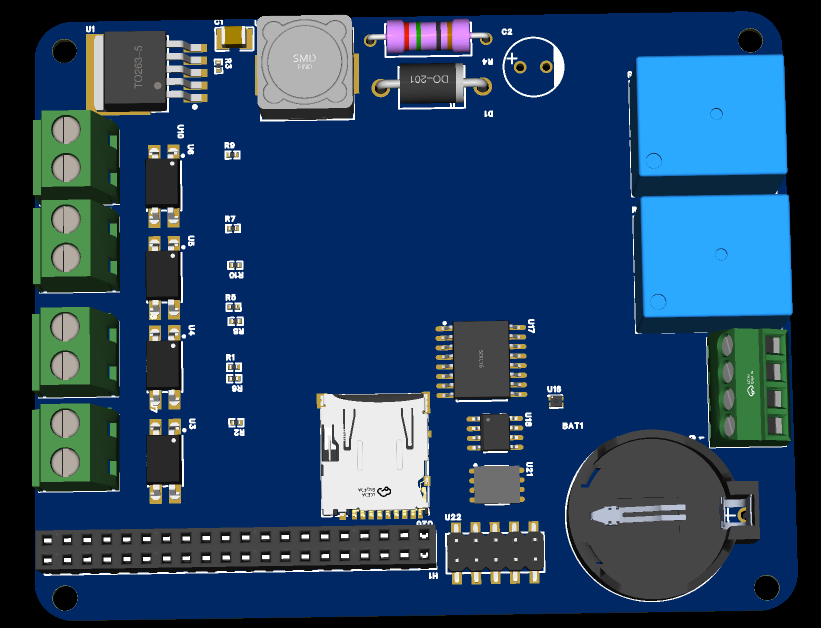

# 🛰️ Edge Nexus: Standalone Industrial Edge Controller

**An autonomous ESP32-S3 based industrial gateway with galvanic isolation and RS-485 communication.**

## 🚀 The Vision

Edge Nexus is a custom-built industrial controller designed to bridge the gap between IoT microcontrollers and high-noise environments. Originally a shield for AI SoCs, the project **pivoted to a standalone architecture** to focus on true hardware engineering and deterministic industrial automation.

Designed by a Computer Engineering student, Edge Nexus provides a reliable, isolated brain for edge automation, telemetry, and local data logging without the need for expensive, off-the-shelf single-board computers.

## 🔌 Core Hardware Features

- **Brain:** Powered by the **ESP32-S3 (WeAct Studio)**, providing high-performance dual-core processing, WiFi, and Bluetooth.
- **Galvanic Isolation:** 4-channel input protection using PC817 optocouplers. This physically decouples high-voltage spikes from "dirty" industrial sensors from the sensitive MCU logic.
- **Industrial Comms:** Integrated **SP3485 transceiver** for RS-485 / Modbus communication, standard for industrial PLC and sensor networks.
- **Power Management:** Integrated LM2596 buck converter stage. It steps down 12-19V (from laptop bricks) to a stable 5V rail to power the entire system.
- **Actuation & Telemetry:** 
    - Dual **5V Relays** for physical load control.
    - **INA219** for real-time voltage and current monitoring.
    - **DS3231 RTC** with backup battery for precise offline timestamps.
    - **AHT20** sensor for environmental (temperature/humidity) monitoring.
- **Storage:** Onboard **MicroSD slot** for long-term offline data logging.

## 🛠️ Design & Fabrication

### PCB Design (EasyEDA)

*Left: Edge Nexus V2 Standalone Controller | Right: Isolation Gap and Routing.*

### Mechanical Engineering (OnShape)
The enclosure features integrated mounting bosses and optimized internal clearances to house the ESP32-S3 and the dual-relay setup.
- **[OnShape Public Document Link](https://cad.onshape.com/documents/94f51a65c203ef61216a8e76/w/3996b9a7978ffab042ea39f4/e/1a9b65c9926a8d71aaf1da83?renderMode=0&uiState=69c037fa21771c3657426373)**

## 🛒 Replication Cost & BOM

| Component | Quantity | Supplier | Unit Price (Real) | Link |
| :--- | :--- | :--- | :--- | :--- |
| **ESP32-S3 WeAct Studio** | 1 | AliExpress | $6.66 | [Link](https://pt.aliexpress.com/item/1005005592730189.html) |
| **SP3485 RS-485 Transceiver** | 1 | LCSC | $0.45 | [Link](https://www.lcsc.com) |
| **PC817 Optocoupler** | 4 | LCSC | $0.04 | [Link](https://www.lcsc.com) |
| **LM2596S-ADJ Buck Converter** | 1 | LCSC | $0.57 | [Link](https://www.lcsc.com) |
| **DS3231 RTC Module** | 1 | LCSC | $1.20 | [Link](https://www.lcsc.com) |
| **INA219 Current Sensor** | 1 | LCSC | $0.85 | [Link](https://www.lcsc.com) |
| **PCB Manufacturing** | 1 set | JLCPCB | $6.10 | [Link](https://jlcpcb.com) |

> **Total Estimated Project Cost: ~$23.00** (Excluding shipping/tax) - A massive reduction from the original $300 Jetson-based design, focused on pure hardware engineering.

## 📂 Project Structure

*   `BOM.csv`: Complete project Bill of Materials (Main).
*   `/Hardware`:
    *   `/Hardware/3D_Models`: Enclosure and board `.STEP` files.
    *   `/Hardware/Main_Shield`: Fabrication files for the standalone controller.
    *   `/Hardware/PCB`: Original EDA source files (`.epro`).
*   `/Docs`: Assets and documentation images.
*   `JOURNAL.md`: The complete technical development log.

***

_Developed for the Hack Club Blueprint 2026._
_Designed by @EngThi_
